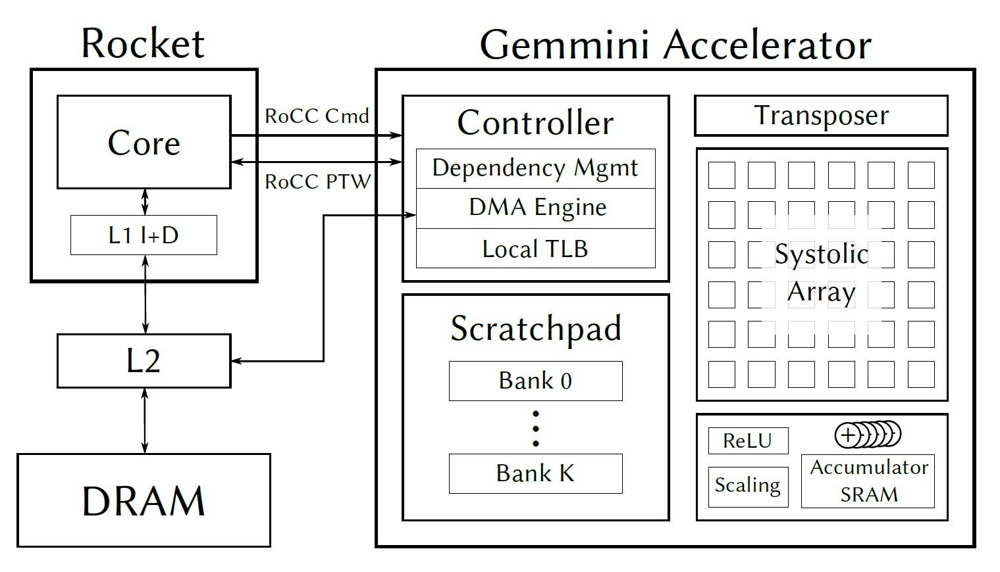
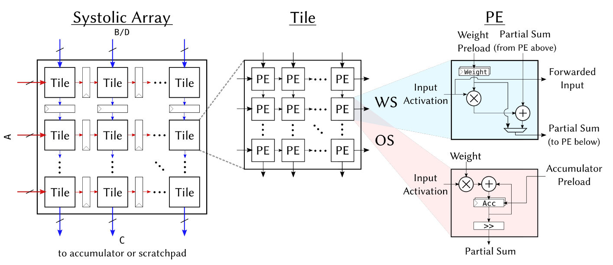

Gemmini
====================================

The Gemmini project is developing a systolic-array based matrix multiplication accelerator generator for the investigation of SoC integration of such accelerators. It is inspired by recent trends in machine learning accelerators for edge and mobile SoCs.

Gemmini is part of the [Chipyard](https://github.com/ucb-bar/chipyard) ecosystem. **For instructions on how to produce Gemmini RTL or to run Gemmini simulations, consult [this page](https://chipyard.readthedocs.io/en/latest/Generators/Gemmini.html) in the Chipyard documentation**. This document is intended to provide more in-depth information for those who might want to start hacking on Gemmini's source code.



Architecture
================

Gemmini is implemented as a RoCC accelerator with non-standard RISC-V custom instructions. The Gemmini unit uses the RoCC port of a Rocket or BOOM _tile_, and by default connects to the memory system through the System Bus (i.e., directly to the L2 cache).

At the heart of the accelerator lies a systolic array which performs matrix multiplications. By default, the matrix multiplication support both _output-stationary_ and _weight-stationary_ dataflows, which programmers can pick between at runtime. However, the dataflow can also be hardened at elaboration time.

The systolic array's inputs and outputs are stored in an explicity managed scratchpad, made up of banked SRAMs. A DMA engine facilitates the tranfer of data between main memory and the scratchpad.

Because weight-stationary dataflows require an accumulator outside the systolic array, we add a final SRAM bank, equipped with adder units, which can be conceptually considered an extension of the scratchpad memory space. The systolic array can store results to any address in the accumulator, and can also read new inputs from any address in the accumulator. The DMA engine can also tranfer data directly between the accumulator and main memory, which is often necessary to load in biases.

Gemmini also includes peripheral circuitry to optionally apply activation functions such as ReLU or ReLU6, scale results down by powers-of-2 to support quantized workloads, or to transpose matrices before feeding them into the systolic array to support the output-stationary dataflow.

Generator Parameters
--------------------------

Major parameters of interest include:

* Systolic array dimensions (``tileRows``, ``tileColumns``, ``meshRows``, ``meshColumns``): The systolic array is composed of a 2-level hierarchy, in which each tile is fully combinational, while a mesh of tiles has pipeline registers between each tile.



* Dataflow parameters (``dataflow``): Determine whether the systolic array in Gemmini is output-stationary or weight-stationary, or whether it supports both dataflows so that programmers may choose between them at runtime.

* Scratchpad and accumulator memory parameters (``sp_banks``, ``sp_capacity``, ``acc_capacity``): Determine the properties of the Gemmini scratchpad memory: overall capacity of the scratchpad or accumulators (in KiB), and the number of banks the scratchpad is divided into.

* Type parameters (``inputType``, ``outputType``, ``accType``): Determine the data-types flowing through different parts of a Gemmini accelerator. For example, ``inputType`` may be an 8-bit fixed-point number, while ``accType``, which determines the type of partial accumulations in a matrix multiplication, may be a 32-bit integer. ``outputType`` only determines the type of the data passed between two processing elements (PEs); for example, an 8-bit multiplication may produce a 16-bit result which must be shared between PEs in a systolic array.

* Access-execute queue parameters (``ld_queue_length``, ``st_queue_length``, ``ex_queue_length``, ``rob_entries``): To implement access-execute decoupling, a Gemmini accelerator has a load instruction queue, a store instruction queue, and an execute instruction queue. The relative sizes of these queue determine the level of access-execute decoupling. Gemmini also implements a reorder buffer (ROB) - the number of entries in the ROB determines possible dependency management limitations.

* DMA parameters (``dma_maxbytes``, ``dma_buswidth``, ``mem_pipeline``): Gemmini implements a DMA to move data from main memory to the Gemmini scratchpad, and from the Gemmini accumulators to main memory. The size of these DMA transactions is determined by the DMA parameters. These DMA parameters are tightly coupled with Rocket Chip SoC system parameters: in particular ``dma_buswidth`` is associated with the ``SystemBusKey`` ``beatBytes`` parameter, and ``dma_maxbytes`` is associated with ``cacheblockbytes`` Rocket Chip parameters.

Software
==========

The Gemmini non-standard ISA extension is specified in the `ISA` section below.
The ISA includes configuration instructions, data movement instructions (from main memory to the Gemmini scratchpad, and from the Gemmini accumulators to main memory), and matrix multiplication execution instructions. 

Since Gemmini instructions are not exposed through the GNU binutils assembler, several C macros are provided in order to construct the instruction encodings to call these instructions.

The Gemmini generator includes a C matrix multiplication library which wraps the calls to the custom Gemmini instructions.
The ``software`` directory of the generator includes the aforementioned library and macros, as well as bare-metal tests, and some FireMarshal workloads to run the tests in a Linux environment. In particular, the matrix multiplication C library can be found in the ``software/gemmini-rocc-tests/include/gemmini.h`` file. 

The Gemmini generator generates a C header file based on the generator parameters. This header files gets compiled together with the matrix multiplication library to tune library performance. The generated header file can be found under ``software/gemmini-rocc-tests/include/gemmini_params.h``

## Build and Run Gemmini Tests

To build the Gemmini tests:

```shell
cd software/gemmini-rocc-tests/
./build.sh
```

Afterwards, the test binaries will be found in `software/gemmini-rocc-tests/build`. Binaries whose names end in `-baremetal` are meant to be run in a bare-metal environment, while binaries whose names end in `-linux` are meant to run in a Linux environment. You can run the tests either on a cycle-accurate RTL simulator, or on a (much faster) functional ISA simulator called Spike.

We use a special fork of Spike, found [here](https://github.com/ucb-bar/esp-isa-sim), which has support for Gemmini instructions. If you are using Chipyard, you can easily build Spike by running `./scripts/build-toolchains.sh esp-tools` from Chipyard's root directory. Then, to run the `mvin_mvout` test, which simply moves a matrix into Gemmini's scratchpad before moving it back out into main memory, run the following commands:

```shell
cd build/bareMetalC
spike --extension=gemmini mvin_mvout-baremetal
```

## Writing Your Own Gemmini Tests
`software/gemmini-rocc-tests/bareMetalC/template.c` is a template Gemmini test that you can base your own Gemmini tests off of. To write your own Gemmini test, run:

```bash
cd software/gemmini-rocc-tests/
cp bareMetalC/template.c bareMetalC/my_test.c
```

Then, add `my_test` to the `tests` list at the top of `bareMetalC/Makefile`. Afterwards, running `./build.sh` will install `my_test-baremetal` in `build/bareMetalC`.

# ISA

This section describes Gemmini's assembly-level ISA which is made up of custom RISC-V instructions.

## Data Movement
### `mvin` Move Data From L2/DRAM to Scratchpad
**Format:** `mvin rs1, rs2`
- `rs1` = virtual DRAM address (byte addressed) to load into scratchpad
- `rs2` = local scratchpad address (systolic array single-axis addressed; i.e. `tileColumns x meshColumns x dataBytes` bytes of data are captured in 1 address)
- `funct` = 2

**Action:** Scratchpad[rs2] <= DRAM[Translate[rs1]]
- Loads a fixed amount of data (`tileColumns x meshColumns x tileRows x meshRows x dataBytes` bytes) into the scratchpad
- Load is sequential from the rs1/rs2 base addresses. Stride must be set by the `config_mvin` command

### `mvout` Move Data from Scratchpad to L2/DRAM
**Format:** `mvout rs1, rs2`
- `rs1` = virtual DRAM address (byte addressed) to write to from scratchpad
- `rs2` = local scratchpad address (systolic array single-axis addressed; i.e. `tileColumns x meshColumns x dataBytes` bytes of data are captured in 1 address)
    - if the 32nd bit is 1, `rs2` refers the accumulator memory space. In this case, the bitwidth of the elements is the accumulated result bitwidth
- `funct` = 3

**Action:** DRAM[Translate[rs2]] <= Scratchpad[rs1]
- Stores a fixed amount of data (`tileColumns x meshColumns x tileRows x meshRows x dataBytes` bytes) from the scratchpad to L2/DRAM
- Store is sequential from the rs1/rs2 base addresses. Stride must be set by the `config_mvout` command

## Configuration
### `config_ex` configures the Execute pipeline
**Format:** `config_ex rs1 rs2`
- `rs1` = `rs1[0:1]` must be `00`. `rs1[2]` will determine if output (0) or weight (1) stationary. `rs1[4:3]` will determine the activation function: either relu (1), relu6 (2), or no activation function (0).
- `rs[63:32]` is the number of bits by which the accumulated result of a matmul is right-shifted when leaving the accumulator
- `rs2[31:0]` = the number of bits by which the accumulated result of a matmul is right-shifted when leaving the systolic array
- `rs2[63:32]` = the number of bits by which 6 should be left-shifted before applying relu6
- `funct` = 0

**Action:** mode <= rs1(2); shift <= rs2

### `config_mvin` configures the Load pipeline
**Format:** `config_mvin rs1 rs2`
- `rs1` = `rs1[0:1]` must be `01`
- `rs2` = the stride in bytes
- `funct` = 0

**Action:** stride <= rs2

### `config_mvout` configures the Store pipeline
**Format:** `config_mvout rs1 rs2`
- `rs1` = `rs1[0:1]` must be `10`
- `rs2` = the stride in bytes
- `funct` = 0

**Action:** stride <= rs2

### `flush` flushes the TLB
**Format:** `flush rs1`
- `rs1` = If `rs1[0]` is 1, then the current TLB request is skipped (if its waiting for an interrupt). Otherwise, the current TLB request is repeated.

**Notes:**

- This instruction executes _as soon as it is received_ without waiting for other instructions which may be queued up. It is the programmer's responsibility to insert fences if necessary.

## Core Matmul Sequences
Every single matrix multiply operation is a combination of `matmul.preload` and `matmul.compute` (due to the length of a single instruction it was split into two instructions). `matmul.preload` should precede the `matmul.compute`.

Example:
```
//// first matmul ////
// rs1 = InputD
// rs2 = OutputC
// rs3 = InputA
// rs4 = InputB
//matmul InputA InputB OutputC InputD
1. matmul.preload $rs1 $rs2
2. matmul.compute $rs3 $rs4
```
**Action:** Scratchpad[rs2] <= Scratchpad[rs3] \* Scratchpad[rs4] + Scratchpad[rs1]

**Notes on addressing:**
- For B or D, the address can be replaced with all high bits to input a 0 matrix instead.
- If the 32nd bit of any address is high, it will point to the accumulator's memory space.

### Preloading
**Format:** `matmul.preload rs1, rs2`
- `rs1` = local scratchpad address (systolic array single-axis addressed) of D matrix (when output-stationary), or B matrix (when weight-stationary)
- `rs2` = local scratchpad address (systolic array single-axis addressed) of C matrix. If this is set to all high bits, then C will not be written to the scratchpad. If the 32nd _and_ 31st bits are high, the result will be accumulated on top of the previous result pointed to by this address in the accumulator
- `funct` = 6

**Commit Behavior:** This instruction commits on the cycle after the systolic array receives it. The systolic array remains idle until the subsequent OS/WS specific instructions are seen.

### Computing
#### Explicitly Preloaded
**Format:** `matmul.compute.preloaded rs1, rs2`
- `rs1` = local scratchpad address (systolic array single-axis addressed) of A matrix
- `rs2` = local scratchpad address (systolic array single-axis addressed) of B matrix (when output-stationary), or D matrix (when weight-stationary)
- `funct` = 4
- This instruction will compute on the value preloaded (D if output-stationary, or B if weight-stationary)

#### Accumulate on Previous Computation
**Format:** `matmul.compute.accumulated rs1, rs2`
- `funct` = 5
- `rs1` and `rs2` have the same encoding as the `matmul.compute.preloaded` encoding
- If output-stationary, this instruction will compute on the previously computed result (C) in the systolic array
- If weight-stationary, this instruction will compute on the previously preloaded weights (B) in the systolic array
