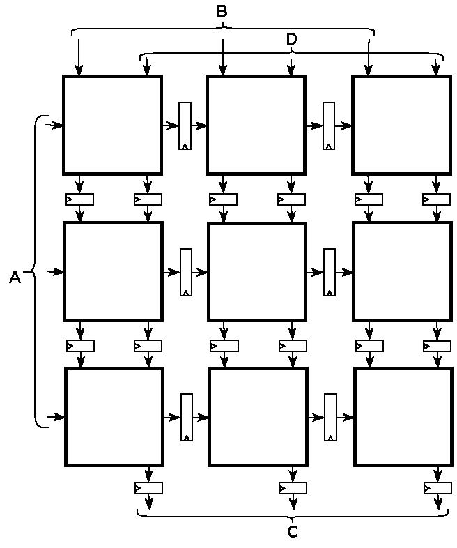
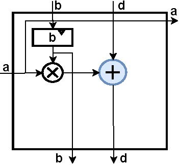
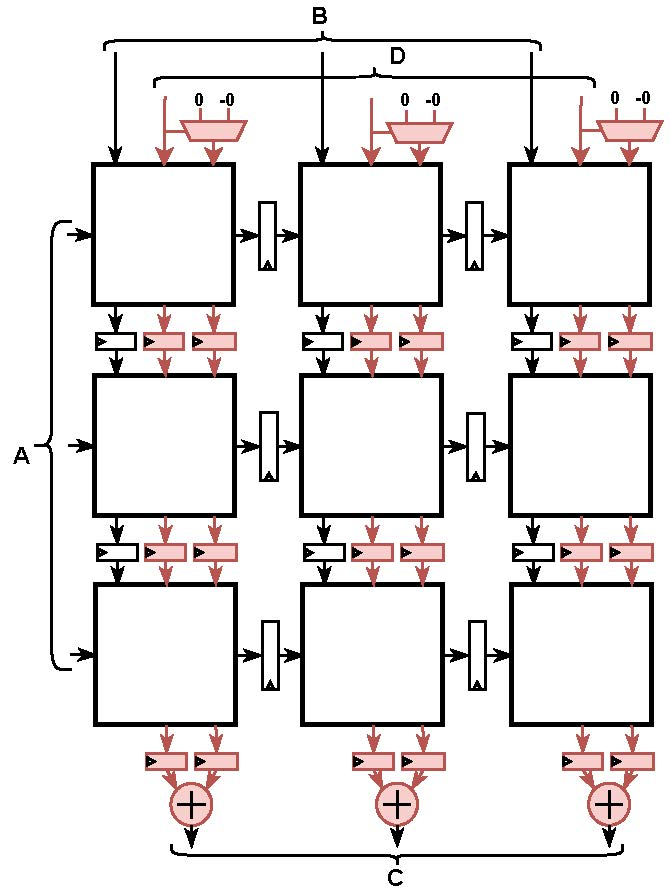
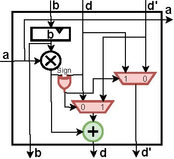

# Gemmini-SEA
The Gemmini-SEA represents features a Sign-Separated Accumulation (SEA)-based weight stationary systolic array implementation. This design is strategically focused on enhancing the resource efficiency of floating-point (FP) addition operations, which are crucial in DNN training accelerators. Unlike traditional accumulation, the Gemmini-SEA architecture innovatively accumulates same-signed terms separately using efficient same-signed FP adders, followed by a final addition of oppositely-signed sub-accumulations. This approach not only leads to a substantial improvement in overall resource efficiency but also maintains accuracy by not introducing approximations or modifications in the rounding mechanism.

## Design Overview


### Original Weight Stationary Systolic Array
<p float="left">
  
   
</p>

In the systolic array, we perform matrix multiplication $C = A*B + D$, where $A$, $B$, and $D$ represent activations, weights, and partial sums, respectively. In a weight stationary systolic array, the weights are preloaded into the array before the actual computation begins.

On the right side of the array, each processing element (PE) starts by loading its weight, denoted as $b$, into a specific register. Once all the weights are loaded, each PE then begins to process input activations, referred to as $a$. These activations are either passed from the adjacent left PE or come directly from the primary input for PEs at the left edge. Simultaneously, each PE receives partial sums, labeled as $d$, from the PE above or directly from the main input for the top row of PEs.

As the computation progresses, each PE transmits its received $a$ and $d$ values to the neighboring PE on its right and below, respectively. Concurrently, it calculates the product of its current input activation $a$ and the pre-stored weight $b$. This product is then added to the received partial sum $d$ to generate a new partial sum, also labeled as $d$. This newly computed $d$ is then sent down to the PE located directly below.

Note the blue FP adder in PE is the generic FP adder.

### SEA-based Weight Stationary Systolic Array

<p float="left">
  
   
</p>

In our SEA-based systolic array, we focus on separately accumulating quantities with the same sign. This means we're dealing with two different kinds of partial sums, labeled as $d$ and $d'$, which each PE handles and moves along. These partial sums have opposite signs and flow from top to bottom in the array. As shown in our diagram, every PE has two partial sums inputs $d$ and $d'$, and two pipeline registers help pass these along. At the very bottom of the array, we place a generic FP adder to wrap up by adding $d$ and $d'$ together. An initialization setup at the top of systolic array to make sure the first row of PEs starts with two inputs 

<p float="left">
  

</p>

PEs take in two distinct partial sums ($d$ and $d'$) with opposing signs. Inside each PE, you'll find a multiplier, a register $b$, and a same-signed FP adder. A key part of this design is the swapping mechanism, made up of two multiplexers and an XOR gate. It makes sure that the partial sum being processed by the same-signed adder matches the sign of the product of the input activation and weight ($a × b$). The other partial sum doesn't change. So, you end up with an updated $d$ that's either $a × b + d$ or $a × b + d'$, depending on how the signs line up in the same-signed FP adder. There's also a bypass path for the partial sum that's not being used, which gets sent as the new $d'$ to the next PE down the line. This way, the $d'$ that gets passed on always has a different sign than the $a × b$ that's being processed.

This design does not introduce any approxmation, despite the little difference that come from FP operations not being associative. Even though it looks like we've upped the number of logic components and FP adders, our design actually leads to lower ADP, energy. Please check our paper for details.

## Getting started

### Dependecies

Our implementation is based on [Gemmini V0.6.4](https://github.com/ucb-bar/gemmini/tree/v0.6.4).  

Before using this repo, plase make sure you can succesuflly install original Chipyard && Gemmini in the above link. You can verify installation by
```
cd chipyard/generators/gemmini
./scripts/run-verilator.sh template
```
It should give you the following output:
